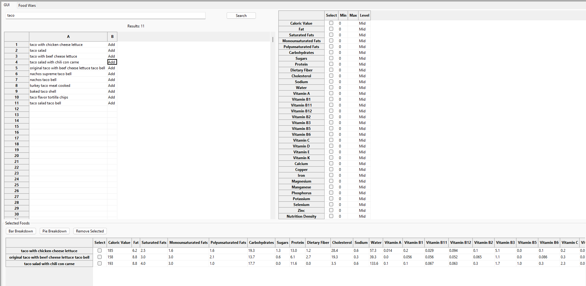
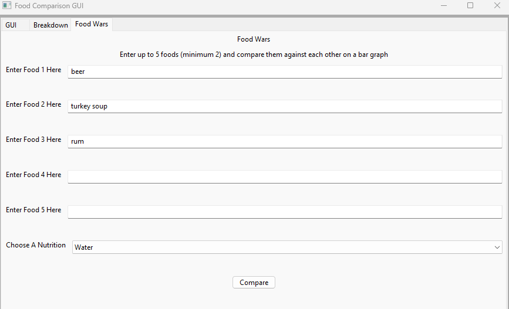
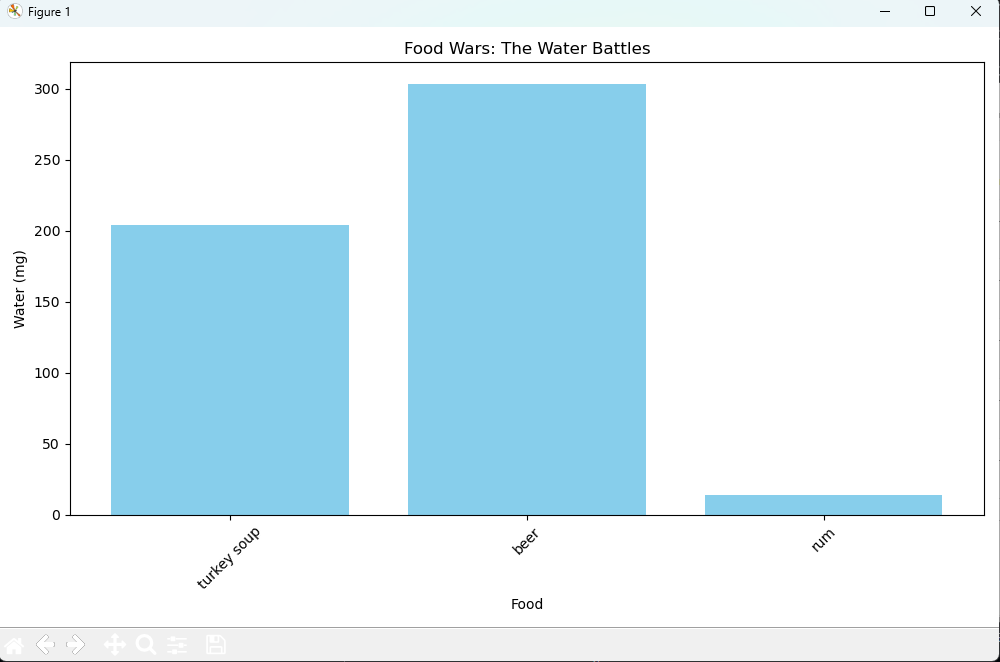

# Executive Summary

Please provide your GitHub repository link.
### GitHub Repository URL: https://github.com/XXXX/XXXXX.git

---

You should use your software to prepare an executive summary as outlined below for the five required features.

## 1. Food Search
### Description  
Allow the user to search for a food and have it output foods matching the input word with the ability to display the information

### Steps
1. Input the food/keyword you wish to search by
2. Press the search button 
3. Click the add button to add the food down to the table to display all the nutritional information about the food 

### Screenshots
Include screenshots for each step demonstrating the use of this feature.  

---

## 2. [Feature 2 Name]
### Description  
Briefly describe what this feature does.

### Steps
1. Step-by-step instructions for using this feature.
2. Add additional steps as needed.

### Screenshots
Include screenshots for each step demonstrating the use of this feature.  

---

## 3. [Feature 3 Name]
### Description  
Briefly describe what this feature does.

### Steps
1. Step-by-step instructions for using this feature.
2. Add additional steps as needed.

### Screenshots
Include screenshots for each step demonstrating the use of this feature.    

---

## 4. [Feature 4 Name]
### Description  
Briefly describe what this feature does.

### Steps
1. Step-by-step instructions for using this feature.
2. Add additional steps as needed.

### Screenshots
Include screenshots for each step demonstrating the use of this feature.    

---

## 5. Food Wars
### Description  
The feature of food wars allows the user to input up to 5 foods with a minimum of 2 and select a nutrition from the drop down menu and it will allow the user to compare the foods on a graph

### Steps
1. Switch to the food wars page by selecting it at the top
2. Input 2-5 foods into the input bars
3. select a nutrition from the drop down menu
4. click compare once you have finished and it will produce a graph

### Screenshots    

---
