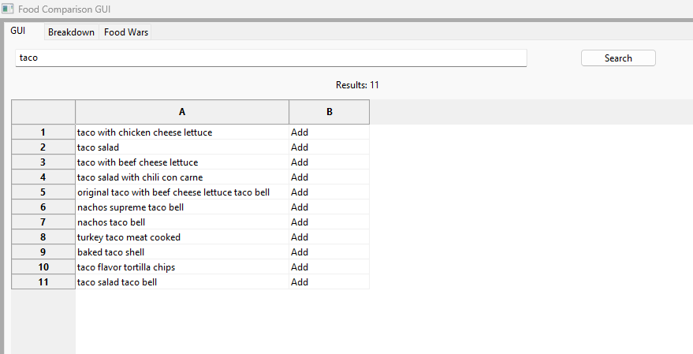

# Executive Summary

Please provide your GitHub repository link.
### GitHub Repository URL: https://github.com/braithicus/2810ICT-Project-Management-Assignment.git

---

You should use your software to prepare an executive summary as outlined below for the five required features.

## 1. Food Search
### Description  
the food search feature allows the user to search for a food and have it output foods matching the input word with the ability to display the information

### Steps
1. Input the food/keyword you wish to search by
2. Press the search button 
3. Click the add button to add the food down to the table to display all the nutritional information about the food 

### Screenshots 

---

## 2. Nutritional Breakdown
### Description  
The nutrition breakdown feature allows the user to breakdown the nutritional information for a specific food in the form of pie or bar graphs

### Steps
1. Search a food you wish to visually assess its nutritional value in a graph 
2. Click add to add the food to the bottom table
3. Select the check box of the food you wish to view in the pie or bar graph
4. Click the button of the graph you want twice for it to load up in an external window

### Screenshots

---

## 3. Nutrion Range Filter
### Description  
The nutrition range filter feature allows the user to select one nutrition and input minimum & maximum values, and the tools will display a list of foods that fall into those ranges

### Steps
1. Select a rnutrition in the side table
2. Enter a value in the min and max coloumn
3. Press search to show the foods that fall within that category

### Screenshots
  

---

## 4. Nutrition Filter Function
### Description  
The nutrtion filter function feature allows the user to select ranges of low, medium and high for nutritional information such as fats, protein carbohydrates, sugar and nutritional density to compare the foods that fall within the ranges visually

### Steps
1. Select a rnutrition in the side table
2. Select low, mid, high from the frop down menu
3. Press search to show the foods that fall within that category

### Screenshots   

---

## 5. Food Wars
### Description  
The feature of food wars allows the user to input up to 5 foods with a minimum of 2 and select a nutrition from the drop down menu and it will allow the user to compare the foods on a graph

### Steps
1. Switch to the food wars page by selecting it at the top
2. Input 2-5 foods into the input bars
3. select a nutrition from the drop down menu
4. click compare once you have finished and it will produce a graph

### Screenshots    

---
