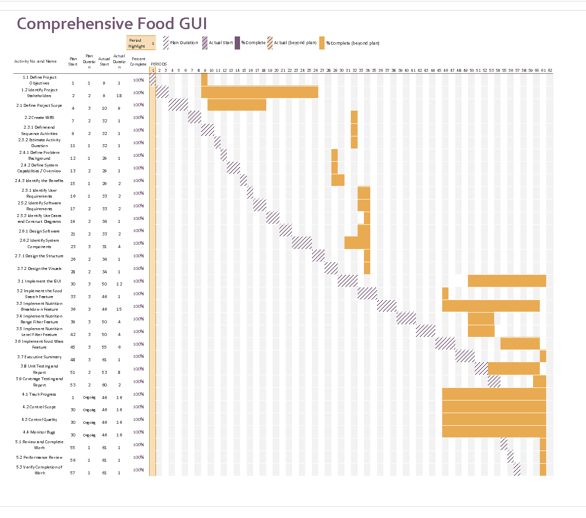

# Project Plan

## Project Name: Comprehensive Food GUI

## Group Number: 023

### Team members

| Student No. | Full Name             | GitHub Username      | Contribution (sum to 100%) |
| ----------- | --------------------- | -------------------- | -------------------------- |
| s5398289    | William-Joseph Simons | William-JosephSimons | 33.3% or Equal             |
| s5265839    | Ben Lange             | s5265839-Griffith    | 33.3% or Equal             |
| s5264208    | Braith Lee            | braithicus           | 33.3% or Equal             |

### Brief Description of Contribution

Please Describe what you have accomplished in this group project.

-  s5398289, William-Joseph Simons
   -  Project Plan Document, System Vision.
-  s222222, Full name
   -  Additional feature creator, Software Design Document
-  s5264208, Braith Lee
   -  Additional stakeholders, 

# Table of Contents

-  [Project Plan](#project-plan)
   -  [1. Project Overview](#1-project-overview)
      -  [1.1 Project Objectives](#11-project-objectives)
      -  [1.2 Project Stakeholders](#12-project-stakeholders)
      -  [1.3 Project Scope](#13-project-scope)
   -  [2. Work Breakdown Structure](#2-work-breakdown-structure)
   -  [3. Activity Definition Estimation](#3-activity-definition-estimation)
   -  [4. Gantt Chart](#4-gantt-chart)

## 1. Project Overview

### 1.1 Project Objectives

-  Provide a tool that allows users to assess the nutritional value of different foods.
-  Provide a tool that allows the consumer to search foods by their name.
-  Provide a tool that allows users to filter the nutritional data according to particular ranges and levels of nutrients
-  Provide a graphical user interface to allow for the data to be interacted with.
-  Allow for a foods nutritional value to be shown visually, with tools such as pie charts and bar graphs.
-  Allow for a visual comparison between 5 chosen foods with pie charts and bar graphs based on a chosen shared nutritional value

### 1.2 Project Stakeholders

#### Project Manager (Internal Executive)

-  <h5 style="display: inline;"> Description: </h5> In charge of managing the project in its entirety and acting as the communicator between all stakeholders, making sure its stays within and meets the requirements of the scope.
-  <h5 style="display: inline;"> Role: </h5> Acts as the main point for communication. Coordinates and integrates the processes of: Initiating, Planning, Executing, Monitoring and Controlling, and Closing. And facilitates decisions made within the core knowledge areas such as: Integration, Scope, Time, Cost, Quality, Human Resources, Communication, Risk, and Procurement. This is done through delegation, or personally by the project manager.

#### Data Analysts (Internal Operational)

-  <h5 style="display: inline;"> Description: </h5> Professionals in the scope of analysing and interpreting data to gain insights and meaning.
-  <h5 style="display: inline;"> Role: </h5> Create algorithms to evaluate the Nutritional_Food_Database.csv, and identify metrics and trends in the data that allow for different visual representations. While also removing any anomalies from the dataset, ensuring high quality data. They also use their findings to effectively communicate complex insights to other stakeholders.

#### Software Developers (Internal Operational)

-  <h5 style="display: inline;"> Description: </h5> People who are skilled in designing, implementing, and testing software applications.
-  <h5 style="display: inline;"> Role: </h5> Implement and document the tools and analytical insights from the data analysts, while ensuring they are of high quality and thoroughly tested. This means ensuring that these tools meet the necessary requirements while being free of bugs, and documenting the process for other stakeholders.

#### Nutritionists and Dietitians (External Operational)

-  <h5 style="display: inline;"> Description: </h5> Professionals that are involved with advising people on their health related goals and their nutritional intake.
-  <h5 style="display: inline;"> Role: </h5> They will use the application to search for specific nutrients and analyse the data to come to conclusions on what the patient should do.

#### Educational Institutions (External Operational)

-  <h5 style="display: inline;"> Description: </h5> Institutions that involve educating the population such as schools and universities. Specifically institutions that teach topics involved with vitamins and nutrients such as health science.
-  <h5 style="display: inline;"> Role: </h5> Institutions will use the application as a resource to teach students about nutrition, and use the visualisation tool as way to better engage the students.

#### Health Conscious Individuals (External Operational)

-  <h5 style="display: inline;"> Description: </h5> A subset of the general public that is conscious of their health and is interested in maintaining a healthy lifestyle and diet.
-  <h5 style="display: inline;"> Role: </h5> These people will use the application to search for nutritional information on the food they are eating to make more informed choices.

#### Researchers (External Operational)

-  <h5 style="display: inline;"> Description: </h5> People within academic institutions that study dietary and nutritional information; doing projects and conducting tests, searching for patterns and how different nutrients impact human health.
-  <h5 style="display: inline;"> Role: </h5> They will use the application for easily searching through nutritional data and for its visualisation tools, to aid research projects.

#### Food Manufacturers (External Operational)

-  <h5 style="display: inline;"> Description: </h5> Companies that are involved in the selling, marketing, or producing food.
-  <h5 style="display: inline;"> Role: </h5> Companies will use the application to become more aware of the relative sizes of different nutrients in their products and to better market the product to consumers based on its content.

#### Regulatory Bodies (External Executive)
-  <h5 style="display: inline;"> Description: </h5> Agencies that ensure compliance with legal and regulatory standards.
-  <h5 style="display: inline;"> Role: </h5> They ensure that the software adheres to national law in terms of nutrition by enforcing regulations and guidelines.

#### Institutional Oversight Committees (External Executive)
-  <h5 style="display: inline;"> Description: </h5> Universities and institutions that ensure the project meets ethical standards, and provide oversight.
-  <h5 style="display: inline;"> Role: </h5> They determine what aspects of the project are approved, the project's funding allocation, and enforce adherence to policies.

### 1.3 Project Scope

#### Inclusions

##### Graphical User Interface

An interface that allows users to easily and graphically navigate the Nutritional_Food_Database.csv.  
It includes:

-  A food item search feature
-  Tools for visualisation, such as bar graphs and pie charts
-  Menus to perform different actions on the data

##### Food Search Feature

A search feature that allows users to search for food items by name and see all its available nutritional data.  
It includes:

-  A search bar where you can enter the name of a food
-  A display that contains the nutritional information available for that food, along with visualisations of the data.
-  An autocomplete feature that helps in finding the desired food

##### Nutrition Breakdown Feature

A feature that allows the user to see the nutritional breakdown of the food item they selected through pie charts and bar graphs.  
It includes:

-  Pie charts and bar graphs
-  An interactive component that allows the user to flip between the bar graphs and pie charts

##### Nutrition Range Filter Feature

Allows users to select a nutrient and gives them the ability to input maximum and minimum values, and displays to them a list of foods that fall within that range.  
It includes:

-  A range menu for choosing between different nutrients
-  Fields to enter the maximum and minimum values
-  A display afterwards that contains the list of foods

##### Nutrition Level Filter Feature

Allows users to filter foods by their nutritional content levels: low, mid, and high. The filter includes: fat, protein, carbohydrates, sugar, and nutritional density.
It includes:

-  Low: Less than 33% of the highest value
-  Mid: Between 33% and 66% of the highest value
-  High: Greater than 66% of the highest value
-  A filter menu for choosing the nutrient
-  A field for choosing low, mid, or high
-  A display afterwards that will contain the list of foods

##### Food Wars

Allow users to compare up to 5 different foods against a chosen nutrient and allow them to visually compare the different foods in a bar and pie graph.
It Includes:

-  A button to access the feature
-  Search bars for the foods and for the nutrient
-  Pie charts and bar graphs

##### Documentation

Documentation of the software that describes how it works, and how its meant to be used.
It includes:

-  Describes how the code will operate (function definitions, data structures, etc.)
-  Descriptions of what the system will do
-  Descriptions on how the user is required to interact with the software

##### Quality Assurance

Testing and validating the software to make sure it fulfils the scope to a high standard and is free of bugs.  
It includes:

-  Bug tracking and fixing
-  Thorough testing of the code

#### Exclusions

##### Real-Time Data Integration

Using a dynamic data source that is up to date.
It excludes:

-  Real time data
-  Data that is dynamic and updates

##### Multi-Language Support

Support for languages other than english within the program.
It excludes:

-  A menu for switching languages
-  A translation tool for the GUI

##### User Authentication and Security Features

Tools that involve authenticating the user and other security.
It excludes:

-  Multi-factor authentication
-  Encryption of the data
-  A login screen

##### Customisation Options

A feature that allows the user to customise the appearance of the GUI.
It excludes:

-  Different themes
-  Extensions

##### Advanced Analytics

Features that include things such as advanced analytics beyond basic filtering, ranges, and charts.  
It excludes:

-  Machine learning
-  Data mining

#### Scope Management

##### Regular Reviews

Rounds of regular reviewing of everyone's work to ensure that it stays within the scope.
It includes:

-  Regular weekly meetings
-  Reports on progress and changes made
-  Communication around the necessary future changes to be made to the project

## 2. Work Breakdown Structure

## 3. Activity Definition Estimation

| Activity #No | Activity Name                             | Brief Description                                                                                                                                                                                        | Duration (Days) | Responsible Team Members |
| ------------ | ----------------------------------------- | -------------------------------------------------------------------------------------------------------------------------------------------------------------------------------------------------------- | --------------- | ------------------------ |
| 1.1          | Define Project Objectives                 | Establish objectives or goals that the project aims to achieve.                                                                                                                                          | 1               | William-Joseph           |
| 1.2          | Identify Project Stakeholders             | Identify all key stakeholders involved in the project, including internal teams and potential end-users.                                                                                                 | 2               | William-Joseph           |
| 2.1          | Define Project Scope                      | Define and manage what is included or excluded in the project and product.                                                                                                                               | 3               | William-Joseph           |
| 2.2          | Create WBS                                | A Work Breakdown Structure for the entire project. The WBS should be presented as a hierarchical diagram. All project activities are considered and included in the WBS.                                 | 2               | William-Joseph           |
| 2.3.1        | Define and Sequence Activities            | Define the activities required for the project based on the WBS, and assign responsibilities to team members. Each activity should be numbered.                                                          | 2               | William-Joseph           |
| 2.3.2        | Estimate Activity Duration                | Provide estimated durations for each activity and use that to create a Gantt chart.                                                                                                                      | 1               | William-Joseph           |
| 2.4.1        | Define Problem Background                 | Identify the problem, dataset, data input/output, and the target users                                                                                                                                   | 1               | William-Joseph           |
| 2.4.2        | Define System Capabilities / Overview     | Define what the system will do and describe the key features and functionalities of the system.                                                                                                          | 2               | William-Joseph           |
| 2.4.3        | Identify the Benefits                     | Identify how the system will provide value and benefit the stakeholders.                                                                                                                                 | 1               | William-Joseph           |
| 2.5.1        | Identify User Requirements                | Detail how users are expected to interact with or use the program. What functionalities must the system provide from the end-user perspective?                                                           | 1               | ???                      |
| 2.5.2        | Identify Software Requirements            | Define the functionality the software will provide. This section should list requirements formally.                                                                                                      | 2               | ???                      |
| 2.5.3        | Identify Use Cases and Construct Diagrams | Include at least 5 use cases, each corresponding to a specific function. Provide a system-level Use Case Diagram illustrating all required features.                                                     | 2               | ???                      |
| 2.6.1        | Design Software                           | Include a flowchart that illustrates how the software will operate.                                                                                                                                      | 2               | ???                      |
| 2.6.2        | Identify System Components                | List all key functions within the software. List all data structures or sources used in the software. Provide pseudocode or flowcharts for all the functions listed that operate on the data structures. | 3               | ???                      |
| 2.7.1        | Design the Structure                      | Present a structural design, a hierarchy chart, showing the overall interface’s structure.                                                                                                               | 2               | ???                      |
| 2.7.2        | Design the Visuals                        | Include all wireframes or mock-ups of the interface. Provide a discussion, explanation, and justification for the design choices.                                                                        | 2               | ???                      |
| 3.1          | Implement the GUI                         | Implement the graphical user interface. This includes using wxFormBuilder to develop the layout.                                                                                                         | 3               | ???                      |
| 3.2          | Implement Food Search Feature             | Code all the functions that enable the user to search for foods by name. Including the event that calls the nutrition breakdown feature.                                                                 | 3               | ???                      |
| 3.3          | Implement Nutrition Breakdown Feature     | Code all the functions that enable the user to see pie charts and bar graphs that display the nutritional breakdown of the selected food.                                                                | 3               | ???                      |
| 3.4          | Implement Nutrition Range Filter Feature  | Code all the functions that enable the user to see a list of food filtered by a minimum and maximum range of a specific nutrient.                                                                        | 3               | ???                      |
| 3.5          | Implement Nutrition Level Filter Feature  | Code all the functions that enable the user to see a list of foods filtered by low, mid, or high levels of a selected nutrient.                                                                          | 3               | ???                      |
| 3.6          | Implement Food Wars Feature               | Code all the functions that allow the user to compare up to 5 different foods against a chosen nutrient and the charts to compare the different foods.                                                   | 3               | ???                      |
| 3.7          | Conduct Testing                           | Perform testing on the code to ensure there are no bugs and that the code meets the scope.                                                                                                               | 5               | ???                      |
| 4.1          | Track Progress                            | Monitor the progress of the project to ensure it keeps pace with timelines and milestones.                                                                                                               | Ongoing         | ???                      |
| 4.2          | Control Scope                             | Ensure the progress stays within the scope by managing changes made.                                                                                                                                     | Ongoing         | ???                      |
| 4.3          | Control Quality                           | Ensure the application meets high standards by conducting reviews against the rubric.                                                                                                                    | Ongoing         | ???                      |
| 4.4          | Monitor Bugs                              | Track known bugs that are found during testing. Manage the bugs to ensure stability of the application.                                                                                                  | Ongoing         | ???                      |
| 5.1          | Review and Complete Work                  | Review the completed work to ensure it meets the objectives that were set.                                                                                                                               | 1               | All                      |
| 5.2          | Performance Review                        | Ensure that the completed work meets the required standards for the rubric.                                                                                                                              | 1               | All                      |
| 5.3          | Verify Completion of Work                 | Final review with the entire team to ensure everyone agrees on the application standard, and that it is ready to send.                                                                                   | 1               | All                      |

## 4. Gantt Chart

