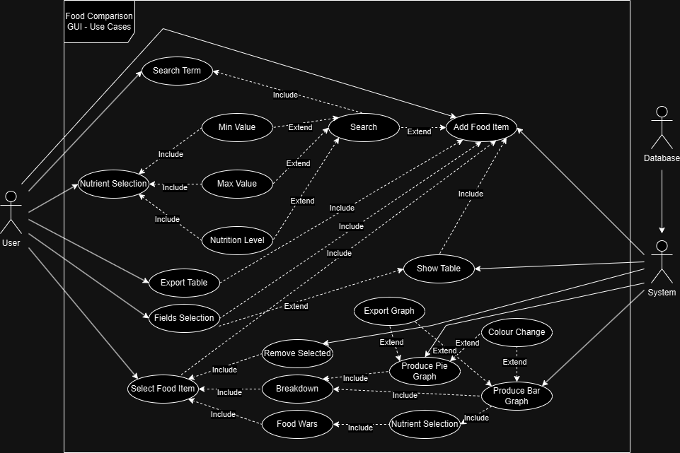
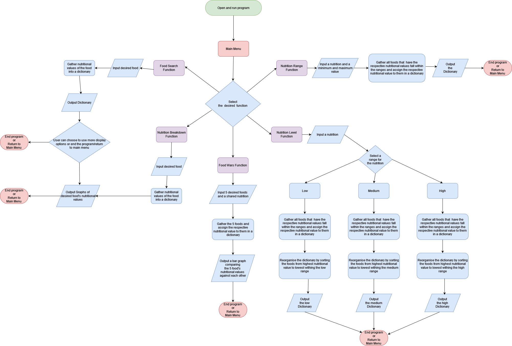
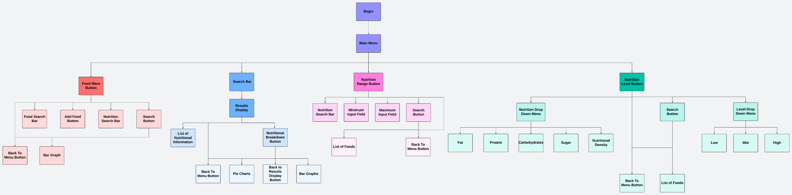

# Software Design Document

## Project Name: Comprehensive Food GUI

## Group Number: 023

## Team Members

| Student Number | Name                  |
| -------------- | --------------------- |
| s5398289       | William-Joseph Simons |
| s5265839       | Benjamin Lange        |
| s5264208       | Braith Lee            |

# Table of Contents

<!-- TOC -->

- [Software Design Document](#software-design-document)
  - [Project Name: Comprehensive Food GUI](#project-name-comprehensive-food-gui)
  - [Group Number: 023](#group-number-023)
  - [Team Members](#team-members)
- [Table of Contents](#table-of-contents)
  - [1. System Vision](#1-system-vision)
    - [1.1 Problem Background](#11-problem-background)
        - [Data Input](#data-input)
        - [Data Output](#data-output)
        - [Target Users](#target-users)
          - [Nutritionists and Dietitians](#nutritionists-and-dietitians)
          - [Educational Institutions](#educational-institutions)
          - [Health Conscious Individuals](#health-conscious-individuals)
          - [Researchers](#researchers)
          - [Food Manufacturers](#food-manufacturers)
    - [1.2 System Capabilities/Overview](#12-system-capabilitiesoverview)
      - [System Functionality](#system-functionality)
      - [Features and Functionalities:](#features-and-functionalities)
        - [GUI](#gui)
        - [Food Search](#food-search)
        - [Nutrition Breakdown](#nutrition-breakdown)
        - [Nutrition Range Filter](#nutrition-range-filter)
        - [Nutrition Level Filter](#nutrition-level-filter)
        - [Food Wars](#food-wars)
    - [1.3 Benefit Analysis](#13-benefit-analysis)
        - [1. Informed Dietary Choices](#1-informed-dietary-choices)
        - [2. Efficient Nutritional Research](#2-efficient-nutritional-research)
        - [3. Enhances Dietitians and Nutritionists](#3-enhances-dietitians-and-nutritionists)
        - [4. Educational Resource](#4-educational-resource)
        - [5. Marketing](#5-marketing)
        - [6. Time and Effort Savings](#6-time-and-effort-savings)
        - [7. Weighing pros and cons of different foods based on nutrional criteria](#7-weighing-pros-and-cons-of-different-foods-based-on-nutrional-criteria)
  - [2. Requirements (FURPS+)](#2-requirements-furps)
    - [2.1 User Requirements](#21-user-requirements)
      - [Fictional Users](#fictional-users)
      - [User Narratives](#user-narratives)
      - [User Needs](#user-needs)
    - [2.2 Software Requirements](#22-software-requirements)
      - [Functionality:](#functionality)
      - [Usability:](#usability)
      - [Reliability:](#reliability)
      - [Performance:](#performance)
      - [Supportability:](#supportability)
      - [+ Additional:](#-additional)
    - [2.3 Use Case Diagram](#23-use-case-diagram)
    - [2.4 Use Cases](#24-use-cases)
  - [3. Software Design and System Components](#3-software-design-and-system-components)
    - [3.1 Software Design](#31-software-design)
    - [3.2 System Components](#32-system-components)
      - [3.2.1 Functions](#321-functions)
      - [3.2.2 Data Structures / Data Sources](#322-data-structures--data-sources)
      - [3.2.3 Detailed Design](#323-detailed-design)
  - [4. User Interface Design](#4-user-interface-design)
    - [4.1 Structural Design](#41-structural-design)
    - [4.2 Visual Design](#42-visual-design)

## 1. System Vision

### 1.1 Problem Background

-  <h5 style="display: inline;"> Problem Identification: </h5> This application fills the need for an easy to use tool that makes it possible for people to search for, analyse, visualise, and evaluate nutritional data for a variety of foods. This is specifically targeted and most useful for people who want to perform nutritional research and make informed decisions, or potentially give dietary advice. The current issues that aries without the use of this tool is the difficulty in determining the nutritional value of foods. This leads to unnecessary difficulty when trying to make healthy lifestyle choices, and when trying to carry out nutritional related research or education.
-  <h5 style="display: inline;"> Dataset: </h5> The Nutritional_Food_Database.csv is being used. This is a static food dataset that contains information regarding the nutritional information on a variety of foods. Columns in the dataset include:
-  -  Food
   -  Caloric Value
   -  Fat
   -  Carbohydrates
   -  Sugar
   -  Protein
   -  Nutritional Density
   -  Many other metrics for nutrition

##### Data Input

-  Users will be entering the names of foods to search the dataset.
-  Users will be selecting specific foods to see visualisation tools on its nutritional content.
-  Users will be inputting minimum and maximum values for a nutrition to display foods that fall within that range.
-  Users will be inputting a low, mid, or high level for a specific nutrient to display a list of filtered food items that fall within that range.
-  Users will be inputting up to 5 different foods along with a specific nutrient to be used to display a visual comparison between the foods based on the nutritonal value
-  The users will be accessing the Nutritional_Food_Database.csv via their inputs above.

##### Data Output

-  Visualisation tools such as pie charts and bar graphs when a food item is searched or clicked from a display.
-  A list of foods after the user inputs minimum and maximum values from the range menu
-  A list of foods after the user inputs a low, mid, or high value from the filter menu.
-  A bar graph of up to 5 foods based on a specific nutritional value that user had inputted

##### Target Users

###### Nutritionists and Dietitians

-  Why: To search for specific nutrients and analyse the data to give informed advice.

###### Educational Institutions

-  Why: As a resource to teach students about nutrition, and use the visualisation tool as way to better engage students.

###### Health Conscious Individuals

-  Why: To search for nutritional information on the food they are eating to make more informed choices.

###### Researchers

-  Why: For easily searching through nutritional data and for its visualisation tools, to aid research projects.

###### Food Manufacturers

-  Why: To become more aware of the relative sizes of different nutrients in their products and to better market the product to consumers based on its content.

### 1.2 System Capabilities/Overview

#### System Functionality

-  Users of the system will be able to search, filter, and visualise nutritional data from the Nutritional_Food_Database.csv with a user-friendly graphical user interface. The main objective is to allow users to more easily gain access to nutritional data so that they can gain insight into the content of their food.

#### Features and Functionalities:

##### GUI

-  An interface that allows users to easily and graphically navigate the Nutritional_Food_Database.csv.
   -  Functionality:
      -  A food item search feature
      -  Tools for visualisation, such as bar graphs and pie charts
      -  Menus to perform different actions on the data

##### Food Search

-  A search feature that allows users to search for food items by name and see all its available nutritional data.
   -  Functionality:
      -  A search bar where you can enter the name of a food
      -  A display that contains the nutritional information available for that food, along with visualisations of the data.
      -  An autocomplete feature that helps in finding the desired food

##### Nutrition Breakdown

-  A feature that allows the user to see the nutritional breakdown of the food item they selected through pie charts and bar graphs.
   -  Functionality:
      -  Pie charts and bar graphs
      -  An interactive component that allows the user to flip between the bar graphs and pie charts

##### Nutrition Range Filter

-  Allows users to select a nutrient and gives them the ability to input maximum and minimum values, and displays to them a list of foods that fall within that range.
   -  Functionality:
      -  A range menu for choosing between different nutrients
      -  Fields to enter the maximum and minimum values
      -  A display afterwards that contains the list of foods

##### Nutrition Level Filter

-  Allows users to filter foods by the size of a nutrient content level: low, mid, and high. The filter includes: fat, protein, carbohydrates, sugar, and nutritional density.
   -  Functionality:
      -  Low: Less than 33% of the highest value
      -  Mid: Between 33% and 66% of the highest value
      -  High: Greater than 66% of the highest value
      -  A filter menu for choosing the nutrient
      -  A field for choosing low, mid, or high
      -  A display afterwards that will contain the list of foods

##### Food Wars

-  Allow users to compare up to 5 different foods against a chosen nutrient and allow them to visually compare the different foods in a bar graph.

   -  Functionality:
      -  A button to access the feature.
      -  Search bars for the foods and for the nutrient.
      -  Bar graphs.

### 1.3 Benefit Analysis

##### 1. Informed Dietary Choices

-  Benefit: By having easy and quick access to comprehensive nutritional data, users can make more informed dietary decisions.
-  Example: A health conscious person navigates the Nutritional_Food_Database.csv using the GUI. They enter the food 'avocado' into the search feature, and the auto complete allows them to quickly locate the food. Upon making the selection, the application shows the user a nutritional breakdown of the nutrients in the avocado using pie charts and bar graphs. The person can then use this new knowledge to inform themselves on whether they should include avocados in their diet.

##### 2. Efficient Nutritional Research

-  Benefit: More comprehensive and efficient research can be conducted by researchers.
-  Example: In order to conduct research on the impact sugar has on the health of the consumer, a researcher could navigate to the nutrition range feature menu and input sugar. They would then input different minimum and maximum values to display lists of foods with varying levels of sugar. The researcher can then select foods from the list to see a more comprehensive breakdown of the nutrients they contain, utilising the visualisation tools to further analyse the relative content of sugar in the foods.

##### 3. Enhances Dietitians and Nutritionists

-  Benefit: Dietitians are able to give more individualised, precise, and accurate recommendations.
-  Example: If a client is required to cut back on fats, the dietician can utilise the nutrition level filter. By navigating to the filter menu and choosing low for fat. They can use the displayed list to provide customised food recommendations. Or if they want more precise recommendations they can use the range feature for specific amounts.

##### 4. Educational Resource

-  Benefit: The tool can be used by educational institutions to educate people on nutrition and data analysis.
-  Example: The application can be used in a class by a nutrition professor to teach students how to analyse and visualise nutritional data. The professor can search for different foods using the food search feature, and then they can get a nutritional breakdown of the food with pie charts and bar graphs to increase the engagement and understanding from the students, enhancing their learning experience.

##### 5. Marketing

-  Benefit: Manufacturers of food can make more informed choices surrounding the marketing of food.
-  Example: A food manufacturer can examine the nutritional content of their food using the nutrition breakdown feature with the visualisation tools. After the analysing the food, they can pinpoint nutrients that are high within their product such as necessary vitamins and use that as a way to target consumers with their marketing. Manufacturers can also use the nutrition range and filter feature to target specific nutrients to market.

##### 6. Time and Effort Savings

-  Benefit: Having a central, user-friendly source of information that contains a plethora of nutritional information saves time and effort compared to searching many sources for the same information.
-  Example: Using the auto complete of the food search feature allows a user to quickly locate the necessary food item. They search for "chicken breast" and analyse its protein content. The user then uses the nutrition range filter to find food with comparable protein content. They can now make more informed dietary decisions quicker and with less effort.

##### 7. Weighing pros and cons of different foods based on nutrional criteria

-  Benefit: The tool allows the users to compare up to 5 foods based on one nutrient value. This provides the user a unique way of coordinating their foods and making substitutions in their daily lives based off doctor's reccommendation
-  Example: If the doctor says the users has a high colesterol and should cut out steaks for an alternative but the user would like something that would provide the same or similar protien from foods they already have such as chicken breast as an alternative to steak.

## 2. Requirements (FURPS+)

### 2.1 User Requirements

The Comprehensive Food GUI software should be designed with its intended users in mind. They can be generalised as external operational stakeholders, or more specifically as Nutritionists, Dietitians, Educational Institutions, Health Conscious Individuals, etc.

#### Fictional Users

We can create three personalities that represent the intended user groups so that their user needs can be more easily derived:

1. Rebecca is a nutritionist with years of experience. She needs a fast and reliable way to access the detailed dietary compositions of various foods so that she can provide dietary advice for her clients.
2. Michael is a biology teacher who conducts lessons about nutrition and requires an educational tool that visually demonstrates the nutrient content of various foods for his class.
3. Amber is a health-conscious individual who tracks her nutrient consumption daily and wants a simple search engine for food's nutritional values to make sure she stays on target.

#### User Narratives

Rebecca uses the GUI to quickly search for specific foods, visualise their content, and compare different foods to advise her clients on their eating habits. She likes the software's simple interface and how it quickly provides figures, such as pie charts and bar graphs, allowing her to more easily communicate complex nutritional data to clients.

Michael incorporates the GUI into his biology lessons to keep his students visually engaged. The search and filtering features help him show the diversity of foods nutritional content, with the diagrams making the data more digestible for his young students. This allows him to easily show how food impacts the human body.

Amber opens the software daily to make sure she stays on top of her health goals. She relies on the auto-complete feature to quickly find food items and uses the nutritional breakdown tool to double-check that her diet is balanced in terms of protein, carbohydrates, and fats.

#### User Needs

Nutritionists and Dietitians like Rebecca need to be able to:

-  Easily search for foods and their nutritional information.
-  Compare foods based on specific nutrients.
-  Present data in a clear and concise way to clients.

Educators like Michael need to be able to:

-  Access food data quickly to demonstrate concepts in the classroom.
-  Use charts and figures to help students visualise nutrition content.
-  Customise examples to meet the criteria of each lesson.

Health-conscious people like Amber need to be able to:

-  Track and compare the macronutrients of different foods.
-  Receive quick and digestible information on whether their chosen foods meet their nutritional goals.
-  Have access to filtering and comparison tools for easy decision-making.

By outlining the fictional users' tasks and their contexts, we gain the necessary knowledge to define our software's requirements.

### 2.2 Software Requirements

The following project requirements are defined using the FURPS+ Framework and expands upon the user requirements .

#### Functionality:

1. Food Search:

-  R1.1: The program shall provide food options based on the closest matches to the searched string.
-  R1.2: The program shall display the complete nutritional information/record for the selected food item(s).

2. Nutrition Breakdown:

-  R2.1: The program shall provide visual representations (pie charts and bar graphs) of the nutritional content for selected food item(s).
-  R2.2: The program shall allow users to toggle between different visualisation formats (pie charts and bar graphs).

3. Nutrition Range Filter:

-  R3.1: The program shall allow users to select a nutrient and input minimum and maximum values.
-  R3.2: The program shall return a list of food items that fall within the specified nutrient range.

4. Nutrition Level Filter:

-  R4.1: The program shall categorize food items by their nutrient content (e.g., fat, protein, sugar) into low, mid, or high ranges.
-  R4.2: The program shall allow users to filter food items based on these predefined nutrient levels.

5. Food Wars:

-  R5.1: The program shall allow users to compare the nutritional content of up to five different food items side by side.
-  R5.2: The program shall visualize the comparison data in bar graph format, showing the differences across selected nutrients.

#### Usability:

1. Ease of Navigation:

-  R1.1: The program shall provide a clear and intuitive graphical user interface (GUI) that allows users to navigate the food database easily.
-  R1.2: The program shall ensure that all primary features are accessible within three clicks from the main screen.

2. Interactive Figures:

-  R2.1: The program shall provide tooltips and labels in figures for better understanding of the data.
-  R2.2: The program shall support dynamic features in charts and graphs, allowing users to remove and add elements for enhanced data analysis.

3. Autocomplete Search:

-  R3.1: The search field shall provide an optional autocomplete feature, allowing users to quickly locate food items based on partial inputs.
-  R3.2: The program shall prioritize suggestions based on relevance and previous searches.

4. Figure Exportation:

-  R4.1: The program shall offer an export option for visualizations, including clearly labeled export buttons and straightforward file format selection.
-  R4.2: The program shall show a confirmation or error message after an exportation attempt.

#### Reliability:

1. Error Handling:

-  R1.1: The program shall produce error messages when users enter invalid inputs or when the program encounters an error while retrieving data.
-  R1.2: The program shall inform the user if there is data missing from the database.
-  R1.3: The program shall ensure that all interactions with the Nutritional_Food_Database.csv are read-only operations, preventing any modifications to the database.

#### Performance:

1. Response Time:

-  R1.1: The program shall return search results and filter data within 3 seconds.
-  R1.2: The program shall load and render visualizations (pie charts and bar graphs) within 2 seconds of a user selecting a food item.

#### Supportability:

1. Documentation:

-  R1.1: The program shall include user documentation that details how to perform searches, use filters, and access visualizations.

2. Help System:

-  R2.1: The program shall provide a help menu or FAQ section within the application that explains the common steps of use.

#### + Additional:

1. User Personalisation:

-  R1.1: The program shall allow users to customize their interface settings, such as graph or theme colors.

2. Accessibility:

-  R2.1: The program shall be designed to be accessible for users with disabilities

### 2.3 Use Case Diagram

Provide a system-level Use Case Diagram illustrating all required features.

Example:  

**FROM RUBRIC: Includes a complete and accurate system-level use case diagram that is well integrated with the text. MAKE SURE THIS IS SYSTEM LEVEL AND NOT SPECIFIC /1.0**

### 2.4 Use Cases

Include at least 5 use cases, each corresponding to a specific function.

| Use Case ID    | 01                                                                                                                                                                                                          | 02                  | 03                     | 04                     | 05        |
|----------------|-------------------------------------------------------------------------------------------------------------------------------------------------------------------------------------------------------------|---------------------|------------------------|------------------------|-----------|
| Use Case Name  | Food Search By Name                                                                                                                                                                                         | Nutrition Breakdown | Nutrition Range Filter | Nutrition Lever Filter | Food Wars |
| Actors         | User                                                                                                                                                                                                        | User                | User                   | User                   | User      |
| Description    | The user searches for a food item by typing its name into the search bar and pressing Enter or clicking the search button. The system returns the nutritional data for the specified food.                  | The user            | xxxx                   | xxxx                   | xxxx      |
| Flow of Events | 1. The user types the name of the food into the search bar (e.g. "Apple") 2. User clicks the search button or presses enter 3. Nutritional data is retrieved from database 4. Data is displayed | xxxx                | xxxx                   | xxxx                   | xxxx      |
| Alternate Flow | If the food does not exist in the dataset, the system shows a "Food not found" message.                                                                                                                     | xxxx                | xxxx                   | xxxx                   | xxxx      |

**FROM RUBRIC: Includes at least 5 detailed use cases, each with comprehensive descriptions and flows. /1.0**

## 3. Software Design and System Components

### 3.1 Software Design

Include a flowchart that illustrates how your software will operate.

Example:  

### 3.2 System Components

#### 3.2.1 Functions

List all key functions within the software. For each function, provide:

-  <h5 style="display: inline;"> Description: </h5> When creating functions of the software it is necessary to reflect on the purpose of the software. For this case we would want:
    
    - <h6 style="display: inline;"> Food Search Function: </h6> to create a system that allows the users to analyse all nutritional information for specific foods
    - <h6 style="display: inline;"> Nutrition Breakdown Function: </h6> breakdown the nutritional information for a specific food in the form of pie and bar graphs
    - <h6 style="display: inline;"> Nutrition Range Filter Function:  </h6> allow the user to select one nutrition and input minimum & maximum values, and the tools will display a list of foods that fall into those ranges 
    - <h6 style="display: inline;"> Nutrition Level Filter Function: </h6> allow the user to select ranges of low, medium and high for nutritional information such as fats, protein carbohydrates, sugar and nutritional density to compare the foods that fall within the ranges visually 
    - <h6 style="display: inline;"> Food Wars Function: </h6> allow the user to select 5 chosen foods and compare them against each other visually with a bar graph based on a one selected nutritional information

-  <h5 style="display: inline;"> Input Parameters: </h5> 
    
    - <h6 style="display: inline;"> Food Search Function: </h6> The input type would be a search bar where an input string can be entered by the user to look up a certain food and it's nutritional information such as the nutritional information of a pear
    - <h6 style="display: inline;"> Nutrition Breakdown Function: </h6> The input type would be a search bar where an input string can be entered by the user to look up a certain food and then 2 different booleans as to allow the user to pick between having a bar graph or not and having a pie chart or not. "Bar Graph: Y/N " "Pie Chart: Y/N "
    - <h6 style="display: inline;"> Nutrition Range Filter Function: </h6> The input would be a combination of 3 different input fields one to search the nutrient the user is looking to find a range for and 2 input fields where both take numbers with one taking the minimum value and the other taking the maximum value. The input of the first input field would be for a string while the following 2 input fields would be for a float32 integer to allow the user to input a request such as "fats, minimum: 0.5000, maximum: 3.1240"
    - <h6 style="display: inline;"> Nutrition Level Filter Function: </h6> The input type would be a search bar where an input string can be entered by the user to look up a nutrient then to have another input as a multiple choice to select the filter option for the foods for a nutrient using such as "protein" into the options of "low", "medium", "high". This is achieved by assigning low, medium and high a numerical value and asking the user for an input of the numerical value assigned to the filter options such as "1, 2 or 3"
    - <h6 style="display: inline;"> Food Wars Function: </h6> he input would be a combination of 5 different search bars input fields that allow the user to input up to 5 foods as a string such as "cheese sticks" "pear" "apple" "hummus" "fried rice" then another search bar as an input field for a user to enter a string for the nutritional information such as "sugar".

-  <h5 style="display: inline;"> Return Value: </h5> Describe what the function returns.

   -  <h6 style="display: inline;"> Food Search Function: </h6> Would display all the information returned for the selected food such as in a dictionary for the user to view.
   -  <h6 style="display: inline;"> Nutrition Breakdown Function: </h6> Would display all the information for the selected food's nutritional information as a bar or pie chart.
   -  <h6 style="display: inline;"> Nutrition Range Filter Function: </h6> Would display all the foods between the selected minimum and maximum of the selected nutrition as a dictionary going from the food closest to the maximum with its value to the food closest to the minimum.
   -  <h6 style="display: inline;"> Nutrition Level Filter Function: </h6> Have the foods that fall within the chosen parameters of low, medium or high for the selected nutritional value as a dictionary which will display the foods from the highest nutritional values to the lowest with the names of the foods.
   -  <h6 style="display: inline;"> Food Wars Function: </h6> It would have the function return up to the 5 selected foods compared against the nutritional value selected in the form of a bar graph.

-  <h5 style="display: inline;"> Side Effects: </h5> Note any side effects, such as changes to global variables or data passed by reference.

   -  <h6 style="display: inline;"> Nutrition Range Filter Function:  </h6>  When using the sorted function on the dictionary to turn it into a sorted list then to turn the list back into a sorted dictionary, we would not be using the dictionary creates a new dictionary based on the sorted list while the original dictionary still exists. This creates the unwanted side effect of not sorting original dictionary but having a sorted dictionary created a sorted list of the original dictionary created using the sorted function.
   -  <h6 style="display: inline;"> Nutrition Level Filter Function: </h6> When using the sorted function on the dictionary to turn it into a sorted list then to turn the list back into a sorted dictionary, we would not be using the dictionary creates a new dictionary based on the sorted list while the original dictionary still exists. This creates the unwanted side effect of not sorting original dictionary but having a sorted dictionary created a sorted list of the original dictionary created using the sorted function.

#### 3.2.2 Data Structures / Data Sources

List all data structures or sources used in the software. For each, provide:

-  **Type**: Dictionary
-  **Usage**: Dictionaries are used in the system to help display and organise the data in a presentable and usuable format for the system and user. It is used to display the outputs of nutrtional values of selected foods for the user or the foods that fall within specified ranges based on selected nutrition and nutritional values for the user. It is also used by the system to keep order of the values associated with the food or nutrition
-  **Functions**: List functions that utilize this structure. all of the functionsuse dictionaries in some way or another
-  **Type**: List
-  **Usage**: Lists are background to help organise the data in a more presentable format because of how dictionaries work. Since by taking the values straight from the csv will leave the dictionary unsorted, we can sort this in python by using the sorted function, when this happens the sorted funtion outputs a sorted list of the keys from the dictionaries by altering how the sorted function sorts we can sort the dictionary by values in a list which convert back to a dictionary
-  **Functions**: List functions that utilize this structure. The functions that the use lists are the Nutriton Range Filter Function and the Nutrition Level Filter Function as both benefit from a sorted dictionary

#### 3.2.3 Detailed Design

Provide pseudocode or flowcharts for all functions listed in Section 3.2.1 that operate on data structures. For instance, include pseudocode or a flowchart for a custom searching function.

-  <h5 style="display: inline;"> Assumptions: </h5> Assumtptions for all pseudocode.

   -  csv is converted into dictionaries
   -  Dictionaries are structred like this:
      -  <Strong>{Food: Food name, Nutrient 1: Nutrient 1 value, Nutrient 2: Nutrient 2 value, Nutrient 3: Nutrient 3 value}</strong>
   -  Dictionaries are stored in "list_food_dicts"
   -  No GUI calling to and just does the graph in it

-  <h5 style="display: inline;"> Food Search Function pseudocode: </h5>

function food_search(list_food_dicts): #Asking for user input
food_name = input('Enter the name of a Food: ')

        for food_dict in list_food_dicts:
        if food_dict["Food"] == food_name:
            return food_dict
        else:
    return "Food not found in the list."

result = food_search(list_food_dicts)
print(result)

-  <h5 style="display: inline;"> Nutrition Breakdown Function pseudocode: </h5>

function nutrient_breakdown(list_food_dicts):
food_name = food_search(list_food_dicts)

    if food_name is None:
        print("Food not found in the list.")
        return

    nutrients = ["Nutrient 1", "Nutrient 2", "Nutrient 3"]
    values = [food_name[nutrient] for nutrient in nutrients]

    app = wx.App(False)

    frame = wx.Frame(None, title="Nutrient Breakdown", size=(800, 600))

    panel = wx.Panel(frame)

    figure = Figure()
    canvas = FigureCanvas(panel, -1, figure)

    axes_bar = figure.add_subplot(121)
    axes_bar.bar(nutrients, values)
    axes_bar.set_title("Nutrient Bar Chart")

    axes_pie = figure.add_subplot(122)
    axes_pie.pie(values, labels=nutrients, autopct='%1.1f%%')
    axes_pie.set_title("Nutrient Pie Chart")

    sizer = wx.BoxSizer(wx.VERTICAL)
    sizer.Add(canvas, 1, wx.EXPAND)
    panel.SetSizer(sizer)

    frame.Show()

    app.MainLoop()

nutrient_breakdown(list_food_dicts)

-  <h5 style="display: inline;"> Nutrition Range Filter Function pseudocode:  </h5>

function Nutri_Ran_Fil(list_food_dicts):
while True:
Nutri_x = input("Enter the nutrient name (e.g., Nutri_x): ")

        nutrient_exists = False
        for food_dict in list_food_dicts:
            if Nutri_x in food_dict:
                nutrient_exists = True
                break

        if not nutrient_exists:
            print(" Please try again.")
            continue

        Nutri_x_mini = float(input(f"Enter the minimum value for {Nutri_x}: "))
        Nutri_x_max = float(input(f"Enter the maximum value for {Nutri_x}: "))

        matching_foods = []

        for food_dict in list_food_dicts:
            # Check if the nutrient value falls within the specified range
            if Nutri_x in food_dict and Nutri_x_mini <= food_dict[Nutri_x] <= Nutri_x_max:
                # Create a new dictionary with only the food and nutrient key-value pairs
                filtered_dict = {"Food": food_dict["Food"], Nutri_x: food_dict[Nutri_x]}
                matching_foods.append(filtered_dict)

        if matching_foods:
            print("Foods that meet the requirements:")
            for food in matching_foods:
                print(f"Food: {food['Food']}, {Nutri_x}: {food[Nutri_x]}")
            break
        else:
            print(" Please try again.")

Nutri_Ran_Fil(list_food_dicts)

-  <h5 style="display: inline;"> Nutrition Level Filter Function pseudocode: </h5>

function Nutri_Lev_Fil(list_food_dicts):
lev_choice =["low","mid","high"]

    while True:
        Nutri_x = input("Enter the nutrient name (e.g., Nutri_x): ")

        nutrient_exists = False
        for food_dict in list_food_dicts:
            if Nutri_x in food_dict:
                nutrient_exists = True
                break

        if not nutrient_exists:
            print("Please try again.")
            continue

        level = input("Enter the level (low, mid, high): ").lower()

        if level not in lev_choice:
            print("Invalid level. Please enter 'low', 'mid', or 'high'.")
            continue

        max_value = max(food_dict[Nutri_x] for food_dict in list_food_dicts if Nutri_x in food_dict)

        low_threshold = 0.33 * max_value
        mid_threshold = 0.66 * max_value

        matching_foods = []

        for food_dict in list_food_dicts:
            if Nutri_x in food_dict:
                value = food_dict[Nutri_x]
                if level == "low" and value < low_threshold:
                    matching_foods.append({"Food": food_dict["Food"], Nutri_x: value})
                elif level == "mid" and low_threshold <= value <= mid_threshold:
                    matching_foods.append({"Food": food_dict["Food"], Nutri_x: value})
                elif level == "high" and value > mid_threshold:
                    matching_foods.append({"Food": food_dict["Food"], Nutri_x: value})

        if matching_foods:
            print(f"Foods with {Nutri_x} levels in the {level} range:")
            for food in matching_foods:
                print(f"Food: {food['Food']}, {Nutri_x}: {food[Nutri_x]}")
            break
        else:
            print("Please try again.")

Nutri_Lev_Fil(list_food_dicts)

-  <h5 style="display: inline;"> Food Wars Function pseudocode: </h5>

function Food_Wars(list_food_dicts):
foods = []
while len(foods) < 5:
food_name = input("Enter a food name (or type 'done' to finish): ")
if food.lower() == 'done':
break
foods.append(food)

    if len(foods) < 2:
        print("You must enter at least 2 foods.")
        return

    Nutri_x = input("Enter the nutrient name (e.g., Nutri_x): ")

    nutrient_exists = False
    for food_dict in list_food_dicts:
        if Nutri_x in food_dict:
            nutrient_exists = True
            break

    if not nutrient_exists:
        print("Please try again.")
        return

    nutrient_values = []

    for food in foods:
        food_found = False
        for food_dict in list_food_dicts:
            if food_dict["Food"] == food:
                if Nutri_x in food_dict:
                    nutrient_values.append(food_dict[Nutri_x])
                    food_found = True
                    break
        if not food_found:
            print(f"Food '{food}' not found or does not contain the nutrient '{Nutri_x}'. Please try again.")
            return

    plt.figure(figsize=(10, 6))
    plt.bar(foods, nutrient_values, color='skyblue')
    plt.xlabel('Foods')
    plt.ylabel(Nutri_x)
    plt.title(f'Comparison of {Nutri_x} in Selected Foods')
    plt.show()

Food_Wars(list_food_dicts)

## 4. User Interface Design

### 4.1 Structural Design

Present a structural design, a hierarchy chart, showing the overall interface’s structure. Address:

-  Structure: How will the software be structured?
-  Information Grouping: How will information be organized?
-  Navigation: How will users navigate through the software?
-  Design Choices: Explain why these design choices were made.

### 4.2 Visual Design

Include all wireframes or mock-ups of the interface. Provide a discussion, explanation, and justification for your design choices. Hand-drawn wireframes are acceptable.

-  Interface Components: Clearly label all components.
-  Screens/Menus: Provide wireframes for different screens, menus, and options.
-  Design Details: Focus on the layout and size of components; color and graphics are not required.

<strong>Food comparison main:</strong>

- Design choice 1: 

- Explanation/justification:

- Design choice 2: 

- Explanation/justification:

- Design choice 3: 

- Explanation/justification:
  
<strong>Food Wars:</strong>

- Design choice 1: 

- Explanation/justification:

- Design choice 2: 

- Explanation/justification:

- Design choice 3: 

- Explanation/justification:

<strong>Nutrient Breakown:</strong>

- Design choice 1: 

- Explanation/justification:

- Design choice 2: 

- Explanation/justification:

- Design choice 3: 

- Explanation/justification:

**FROM RUBRIC: Includes all well-labeled wireframes or mock-ups of the interface, with comprehensive discussions and justifications. /2.5pts**

