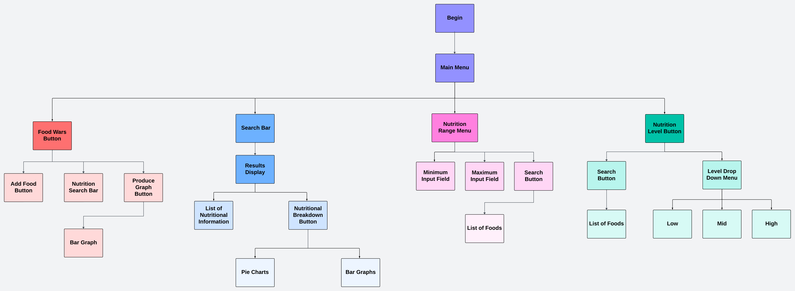

# Software Design Document

## Project Name: Comprehensive Food GUI

## Group Number: 023

## Team members

| Student Number | Name                  |
| -------------- | --------------------- |
| s5398289       | William-Joseph Simons |
| s222222        | Full name             |
| s333333        | Full name             |

# Table of Contents

<!-- TOC -->

-  [Software Design Document](#software-design-document)
   -  [Project Name: Comprehensive Food GUI](#project-name-comprehensive-food-gui)
   -  [Group Number: 023](#group-number-023)
   -  [Team members](#team-members)
-  [Table of Contents](#table-of-contents)
   -  [1. System Vision](#1-system-vision)
      -  [1.1 Problem Background](#11-problem-background)
         -  [Data Input](#data-input)
         -  [Data Output](#data-output)
         -  [Target Users](#target-users)
            -  [Nutritionists and Dietitians](#nutritionists-and-dietitians)
            -  [Educational Institutions](#educational-institutions)
            -  [Health Conscious Individuals](#health-conscious-individuals)
            -  [Researchers](#researchers)
            -  [Food Manufacturers](#food-manufacturers)
      -  [1.2 System capabilities/overview](#12-system-capabilitiesoverview)
         -  [System Functionality](#system-functionality)
         -  [Features and Functionalities:](#features-and-functionalities)
            -  [GUI](#gui)
            -  [Food Search](#food-search)
            -  [Nutrition Breakdown](#nutrition-breakdown)
            -  [Nutrition Range Filter](#nutrition-range-filter)
            -  [Nutrition Level Filter](#nutrition-level-filter)
      -  [1.3 Benefit Analysis](#13-benefit-analysis)
   -  [2. Requirements](#2-requirements)
      -  [2.1 User Requirements](#21-user-requirements)
      -  [2.2 Software Requirements](#22-software-requirements)
      -  [2.3 Use Case Diagram](#23-use-case-diagram)
      -  [2.4 Use Cases](#24-use-cases)
   -  [3. Software Design and System Components](#3-software-design-and-system-components)
      -  [3.1 Software Design](#31-software-design)
      -  [3.2 System Components](#32-system-components)
         -  [3.2.1 Functions](#321-functions)
         -  [3.2.2 Data Structures / Data Sources](#322-data-structures--data-sources)
         -  [3.2.3 Detailed Design](#323-detailed-design)
   -  [4. User Interface Design](#4-user-interface-design)
      -  [4.1 Structural Design](#41-structural-design)
      -  [4.2 Visual Design](#42-visual-design)

## 1. System Vision

### 1.1 Problem Background

-  <h5 style="display: inline;"> Problem Identification: </h5> This application fills the need for an easy to use tool that makes it possible for people to search for, analyse, visualise, and evaluate nutritional data for a variety of foods. This is specifically targeted and most useful for people who want to perform nutritional research and make informed decisions, or potentially give dietary advice. The current issues that aries without the use of this tool is the difficulty in determining the nutritional value of foods. This leads to unnecessary difficulty when trying to make healthy lifestyle choices, and when trying to carry out nutritional related research or education.
-  <h5 style="display: inline;"> Dataset: </h5> The Nutritional_Food_Database.csv is being used. This is a static food dataset that contains information regarding the nutritional information on a variety of foods. Columns in the dataset include:
-  -  Food
   -  Caloric Value
   -  Fat
   -  Carbohydrates
   -  Sugar
   -  Protein
   -  Nutritional Density
   -  Many other metrics for nutrition

##### Data Input

-  Users will be entering the names of foods to search the dataset.
-  Users will be selecting specific foods to see visualisation tools on its nutritional content.
-  Users will be inputting minimum and maximum values for a nutrition to display foods that fall within that range.
-  Users will be inputting low, mid, and high levels for various nutrients to display a list of filtered food items that fall within those ranges.
-  **ADDITIONAL ITEM CONTAINS INPUT**
-  The users will be accessing the Nutritional_Food_Database.csv via their inputs above.

##### Data Output

-  Visualisation tools such as pie charts and bar graphs when a food item is searched or clicked from a display.
-  A list of foods after the user inputs minimum and maximum values from the range menu
-  A list of foods after the user inputs low, mid, and high values from the filter menu.
-  **ADDITIONAL ITEM CONTAINS OUTPUT**

##### Target Users

###### Nutritionists and Dietitians

-  Why: To search for specific nutrients and analyse the data to give informed advice.

###### Educational Institutions

-  Why: As a resource to teach students about nutrition, and use the visualisation tool as way to better engage students.

###### Health Conscious Individuals

-  Why: To search for nutritional information on the food they are eating to make more informed choices.

###### Researchers

-  Why: For easily searching through nutritional data and for its visualisation tools, to aid research projects.

###### Food Manufacturers

-  Why: To become more aware of the relative sizes of different nutrients in their products and to better market the product to consumers based on its content.

### 1.2 System capabilities/overview

#### System Functionality

-  Users of the system will be able to search, filter, and visualise nutritional data from the Nutritional_Food_Database.csv with a user-friendly graphical user interface. The main objective is to allow users to more easily gain access to nutritional data so that they can gain insight into the content of their food.

#### Features and Functionalities:

##### GUI

-  An interface that allows users to easily and graphically navigate the Nutritional_Food_Database.csv.
   -  Functionality:
      -  A food item search feature
      -  Tools for visualisation, such as bar graphs and pie charts
      -  Menus to perform different actions on the data

##### Food Search

-  A search feature that allows users to search for food items by name and see all its available nutritional data.
   -  Functionality:
      -  A search bar where you can enter the name of a food
      -  A display that contains the nutritional information available for that food, along with visualisations of the data.
      -  An autocomplete feature that helps in finding the desired food

##### Nutrition Breakdown

-  A feature that allows the user to see the nutritional breakdown of the food item they selected through pie charts and bar graphs.
   -  Functionality:
      -  Pie charts and bar graphs
      -  An interactive component that allows the user to flip between the bar graphs and pie charts

##### Nutrition Range Filter

-  Allows users to select a nutrient and gives them the ability to input maximum and minimum values, and displays to them a list of foods that fall within that range.
   -  Functionality:
      -  A range menu for choosing between different nutrients
      -  Fields to enter the maximum and minimum values
      -  A display afterwards that contains the list of foods

##### Nutrition Level Filter

-  Allows users to filter foods by their nutritional content levels: low, mid, and high. The filter includes: fat, protein, carbohydrates, sugar, and nutritional density.
   -  Functionality:
      -  Low: Less than 33% of the highest value
      -  Mid: Between 33% and 66% of the highest value
      -  High: Greater than 66% of the highest value
      -  A filter menu for choosing the level of each nutrient
      -  Fields below each nutrient
      -  A display afterwards that will contain the list of foods
   -  **ADDITIONAL FEATURE**

### 1.3 Benefit Analysis

How will this system provide value or benefit?

## 2. Requirements

### 2.1 User Requirements

Detail how users are expected to interact with or use the program. What functionalities must the system provide from the end-user perspective? This can include both narrative descriptions and a listing of user needs.

Note: Since no specific client or user is assigned, you may create a fictional user. Who do you envision using your software?

### 2.2 Software Requirements

Define the functionality the software will provide. This section should list requirements formally, often using the word "shall" to describe functionalities.

Example Functional Requirements:

-  R1.1 The program shall accept multiple file names as arguments from the command line.
-  R1.2 Each file name can be a simple file name or include the full path of the file with one or more levels.

-  etc …

### 2.3 Use Case Diagram

Provide a system-level Use Case Diagram illustrating all required features.

Example:  

### 2.4 Use Cases

Include at least 5 use cases, each corresponding to a specific function.

| Use Case ID    | xxx  |
| -------------- | ---- |
| Use Case Name  | xxxx |
| Actors         | xxxx |
| Description    | xxxx |
| Flow of Events | xxxx |
| Alternate Flow | xxxx |

## 3. Software Design and System Components

### 3.1 Software Design

Include a flowchart that illustrates how your software will operate.

Example:  

### 3.2 System Components

#### 3.2.1 Functions

List all key functions within the software. For each function, provide:

-  Description: Brief explanation of the function’s purpose.
-  Input Parameters: List parameters, their data types, and their use.
-  Return Value: Describe what the function returns.
-  Side Effects: Note any side effects, such as changes to global variables or data passed by reference.

#### 3.2.2 Data Structures / Data Sources

List all data structures or sources used in the software. For each, provide:

-  Type: Type of data structure (e.g., list, set, dictionary).
-  Usage: Describe where and how it is used.
-  Functions: List functions that utilize this structure.

#### 3.2.3 Detailed Design

Provide pseudocode or flowcharts for all functions listed in Section 3.2.1 that operate on data structures. For instance, include pseudocode or a flowchart for a custom searching function.

## 4. User Interface Design

### 4.1 Structural Design

Present a structural design, a hierarchy chart, showing the overall interface’s structure. Address:

-  Structure: How will the software be structured?
-  Information Grouping: How will information be organized?
-  Navigation: How will users navigate through the software?
-  Design Choices: Explain why these design choices were made.

Example:  

### 4.2 Visual Design

Include all wireframes or mock-ups of the interface. Provide a discussion, explanation, and justification for your design choices. Hand-drawn wireframes are acceptable.

-  Interface Components: Clearly label all components.
-  Screens/Menus: Provide wireframes for different screens, menus, and options.
-  Design Details: Focus on the layout and size of components; color and graphics are not required.

Example:  

